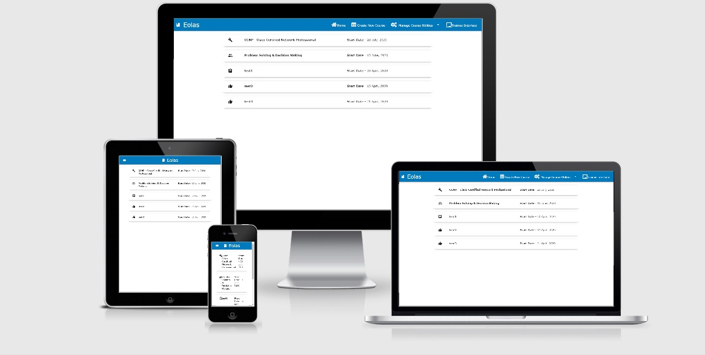
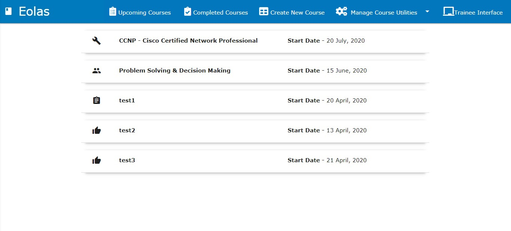
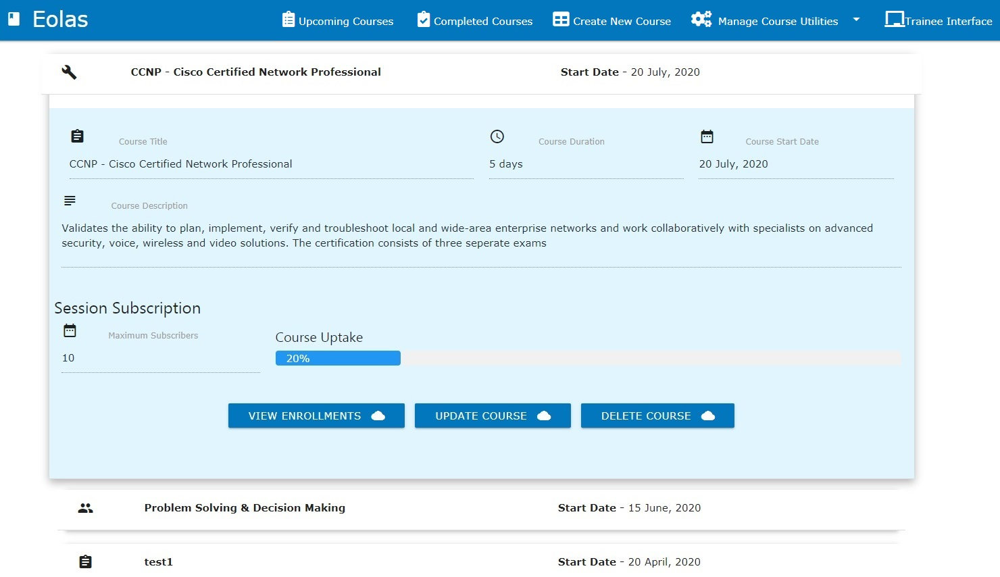
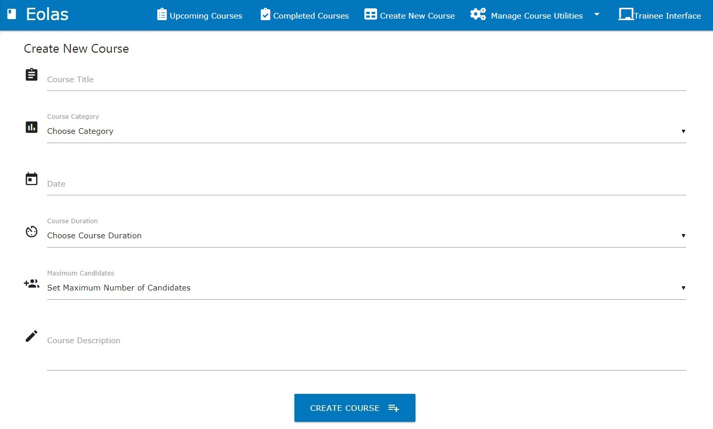
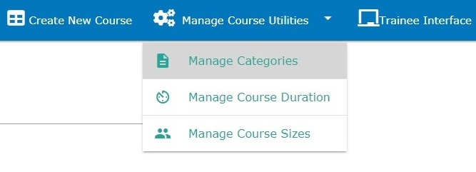
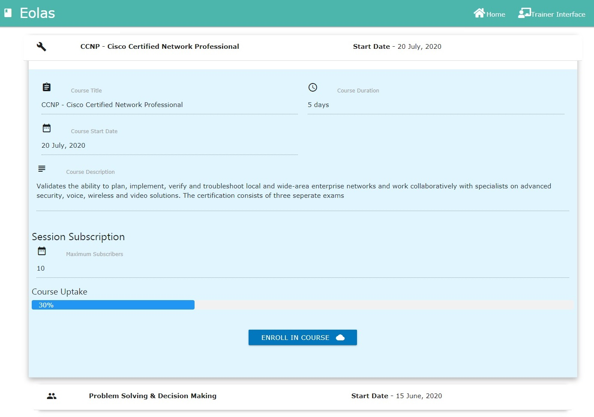
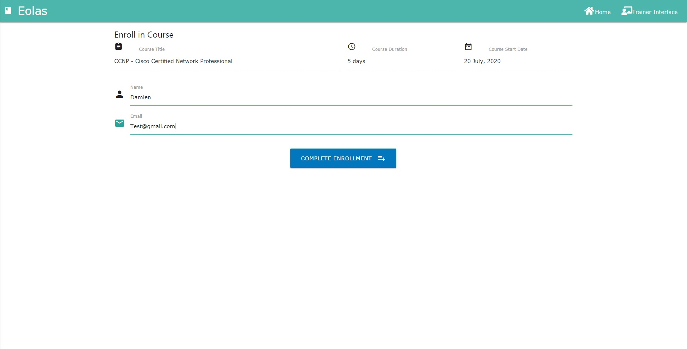
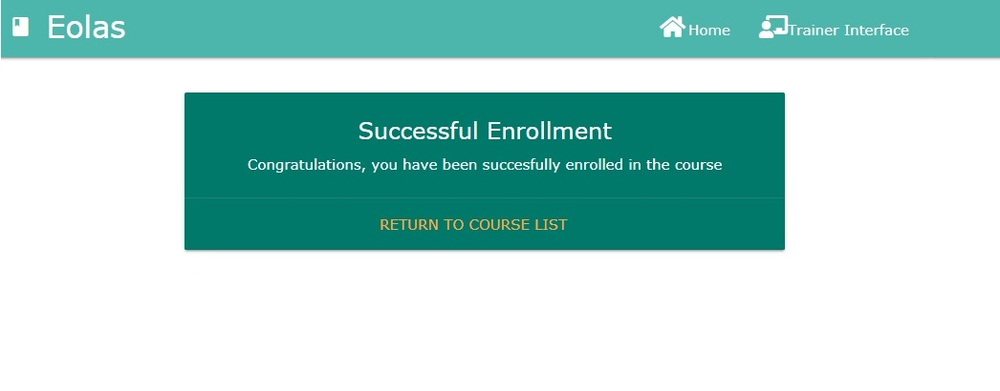
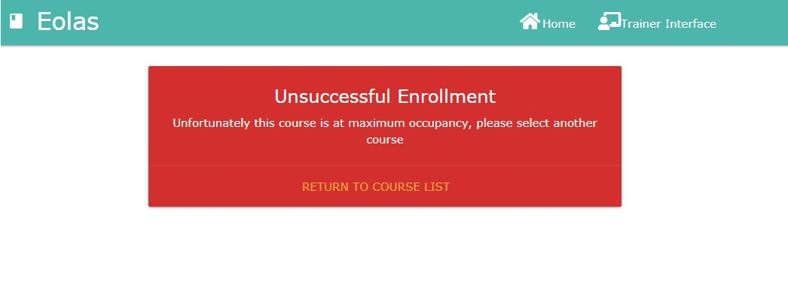

# Damien Meere - BT Ireland
### Practical Python and Data-Centric Development Milestone Project- Code Institute

This project website will highlight my capability to employ the various tools illustrated throughout the Practical Python and Data-Centric Development section of the Code Institute 
programme. 

This project will present a training course booking site, which facilitates the trainer in Creating, Viewing, Editing and Deleting training courses. On creation of a new course,
the trainer specifies the maximum number of subscribers a course can take. In defining this value, only that number of trainees will be permitted to enroll on the course. All elements
of the courses are editable except for the maximum subscriber value. On the trainer view, the trainer can quickly view what the uptake levels are for each course with a progress bar.
The site also enables trainees to view course informaiton, and view the uptake level. And once they have chosen a course, upon submission of their name and email, they will be given 
feedback as to whether their request has been successful of if there are no remaining spaces on a course.

No User Authentication was incorporated into this project, as this is considered beyond the scope of this section of the course. Rather there will be an anonymous Trainer and trainee
area within the site.

## Table of Contents

- [Demo](#Demo)
- [Database](#Database)
- [UX + User Stories](#UX+User-Stories)
- [Technologies](#Technologies)
- [Site Notes](#Site-Notes)
- [Current Features](#Current-Features)
- [Future Features](#Future-Features)
- [Testing](#Testing)
- [Testing -  Unresolved Bugs](#Testing-Unresolved_Bugs)
- [Deployment](#Deployment)
- [Internal Deployment](#Internal-Deployment)

## Demo
A live demo of the project can be found deployed to Heroku [Here](https://dm-milestone-3-code-institute.herokuapp.com/)

## Database

The database itself is stored on [MongoDB](https://www.mongodb.com/). the structure consists for 4 collections. The category, course_duration and course_size collections are utilised
to faciliate more a strucutred approach to course creation. On the course creation pag, these three collections faciliate dropdown menus on the page. The elements of each of these
collections can be created, viewed, edited and deleted from the 'Manage Course Utilities' menu in the site navbar.

The course collection houses the main objects of the site. information relating to all aspects of the course are stored here. This collection is queried to populate the 'accordian'
elements on the main page of the trainer and trainee sections. The percentage value houses an updated string value identifying the current uptake level on the course. As trainees enroll
in courses, this value is updated. The Subscriber_list contains a nested collection of key/value pairs identifying the name and email of all trainees that have requested access 
to a course.

## UX+User-Stories

My goal in building this site was to make it easier to observe and manage information related to training activites within BT Ireland through a simple, easily navigated interface. 
In this process there are two types of actors - Trainers & Trainees. Therefore, in designing this site, I started with the following user stories:

***Trainer Building and diseminating information related to training programmes***
> I wanted easy trainers to be able to create, access, edit and delete information on available training options through a minimalist, sleek, easy-to-navigate site. I wanted the 
trainer to be able to create a course, but to still be directed in some aspects of the course creation. Therefore, a number of fields of the course creation and course editing pages
are populated dropdown menus (Category, Duration & Size), where the contents of the dropdown come from the requisite collections in the [database](#Database). Of course these elements
are not static, and as such, each collection can be all be managed (created, viewed, edited, deleted) from the Manage Course Utilities menu. I also wanted the trainer to be able to 
quickly ascertain the uptake on each course to view the amount of enrollments for each course, so I chose to represent this as a progress bar that gives a quick visual breakdown 
of the enrollments. 

***Trainee Looking to access course information and enroll in their chosen programme***
> I wanted to faciliate a view of the information for trainees where they could get all the information they might require about a particular course and enroll in their chosen 
courses. On submission of an enrollment, should there be sufficient space to accomodate the trainee, they are presented with feedback to confirm their space. If ther is not space 
available, the feedback is presented to notifiy the trainee.

From these user stories, it was clear that quick and easy access to information would be key to ensuring that users could make the most efficient use of the Trainer and Trainee 
interfaces. I needed to make sure that users could quickly navigate the site, and locate any course information they required with minimal prompting. As illustrated by the images 
in the [Wireframes folder](wireframes), even from the early designs, I wanted to ensure thesite was easy-to-navigate and use. As youc an see from the completed 
[project site](https://dm-milestone-3-code-institute.herokuapp.com/), the final version has not strayed far from the originally intended designs.

One alteration is that both trainer and trainee interfaces are easily acessible from the navbar. There is no site authentication in this project, so for demonstrative purposes, 
visitors can quickly move back and forth between the interfaces. In order to ensure continued usability, regardless of accessing device, responsive design has been incorporated to
the project. 

## Technologies
This project utilises the following technologies:
1. [HTML](https://developer.mozilla.org/en-US/docs/Web/HTML)
2. [CSS](https://developer.mozilla.org/en-US/docs/Web/CSS)
3. [Javascript](https://www.w3schools.com/jsref/)
4. [Python](https://www.python.org/)
5. [MongoDB](https://www.mongodb.com/)
6. [Materialize](http://archives.materializecss.com/0.100.2/) (0.100.2)
7. [FontAwesome](https://fontawesome.com/)
8. [JQuery](https://jquery.com)
9. [Git](https://git-scm.com/)
10. [Flask](https://flask.palletsprojects.com/en/1.1.x/)
11. [Heroku](https://www.heroku.com/)

## Site-Notes
As detailed in the [UX + User Stories](#UX+User-Stories) both trainer and trainee interfaces are accessible from the navbar. There is no site authentication in this project, so for 
demonstrative purposes, visitors can quickly move back and forth between the two interfaces. 

## Current-Features
***Home Page - Trainer Interface***
As discussed in the user stories, within the trainer interface, the trainer needs to quickly ascertain information about presented training. Therefore the main landing page for the 
trainer section of the side contains an accordian with each course and it's start date presented to the user, as shown below. When the user, clicks on a particular course, the 
collapsible element opens out to present a more details view of the programme, highlighting the various details of that particular iteration, as well as current uptake in the course 
(shown in progress bar). The icons show to the left of the course title are dependant on the course category chosen (Technical, Soft-Skills, Professional).
A number of buttons also provide prompts for the trainer to manage the courses, allowing for the editing and deleting of a particular course, fulfilling the main requirements for the
trainer highlighted in the user stories.

>Trainer Interface - Closed Menu

>Trainer Interface - Open Menu

***Course Creation Page***
From the navbar, the trainer can navigate to the 'Course Creation' page. Here the trainer can create a new course object that will  be presented in both the trainer and trainee
interfaces. The trainer can set the course title, identify the course category (which sets the course icon ont he home page), set the start date, duration, maximum occupancy and 
provide a description. When the trainer sets the maximum occupancy for the course, this value sets the maximum number of trainees that can enroll from the trainee interface. This 
value cannot be edited from the course edit page. The reason for this is to ensiure that a trainer does not reduce the max occupancy after a number of trainees have enrolled, and cause
discrepancies with the database.

The course edit page takes the same form as the course creation page, with the field filled in for the selected course.

>Course Creation page

***Show Course Enrollments***
From the main trainer interface, the trainer can view the courses, and in particular view the current enrollments for a particular course. When they choose to view the enrollments,
they are presented with the Enrollment interface as shown below. Here they can view the Name and Email address of all trainees that have enrolled for a course. The maximum number of
trainees that will be accepted onto the course is dictated by the max_subscribers value, as defined on the Course Creation page, as shown previously.

>Show Course Enrollments

***Manage Utilities Menu***
The various dropdown menus in the course creation and course edit pages are populated from various utilities that can be altered from the 'Manage Course Utilities' menu in the navbar, 
as shown below. Here, the Category, Duration & Course Size values can be created, edited, & deleted, with any changes reflected in the dropdown menus elsewhere on the site. The reasoning
for utilising dropdown menus was to, as much as possible, direct and standardise the course records.

>Utilities Menu

***Manage Categories***
Each of the utility areas appears in teh saem form as shown below. Trainers can Add, Edit or Delete the values that will appear in the category dropdown menus. The Course duration and 
Maximum Course size take the same form as this.

>Manage Categories Page

***Home Page - Trainee***
Within the trainee interface, as called out in the user stories, the trainee needs to be able to quickly scan through the list of available courses and gather as much information
as they require to decide on a particular course. Therefore, mirroring the Trainer interface, a collapsible accordian element presents all the courses to the trainee. When they click
on a particular course, they are presented with the breakdown shown below. Within the interface, the trainee can navigate to the enrollment page for their particular chosen course.

The trainee interface is distinguished from the trainer interface by the colour scheme of the navbar and the available options in the navbar. Users can navigate between both interfaces
via the navbar.

>Trainee Interface - Open Menu

***Trainee Course Enrollment***
Once the trainee has chosen a particular course, they select the Enrollment button on the course element within the collapsible accordian menu. This brings them to an enrollment page
as shown below, where the trainee can input their name and email. Should there be space to accomodate them on the cousre, their details are presented to the trainer on the 'View Enrollments'
Trainer interface.

>Trainee Interface - Course Enrollment

***Trainee Course Enrollment Success***
On successful enrollment in a course (if there's still spaces), the trainee is presented with the following feedback on seuccessful enrollment.

>Trainee Interface - Enrollment Success

***Trainee Course Enrollment Failure***
If the trainee attempts to enroll in a course that has already reached maximum occupancy, they will be presente with the following feedback to let me know.

>Trainee Interface - Enrollment Failure

## Future-Features
Authentication, Authorisation and Accounting: In the next iteration of this project (see [Internal Deployment](#Internal-Deployment)) user Authentication will be required, utilising internal BT infrastructure.

A [Training Dashboard](https://damien-meere.github.io/interactive_frontend_milestone/) was developed in a previous milestone project. The next step in the evolution of this tool will be to interconnect the two tools, and utilise the dashboard to interogate the dateset generate through the continued use of this tool by both Trainers and Trainees within BT. 

Another useful feature will be to faciliate ongoing easy to understand feedback for both the Trainers and Trainees. Each course will be able to determine the popularity/success of a progamme by enable using to gia ve course an Upvote or a Downvote.This feedback will enable trainees to quickly ascertain how other trainees have felt about a programme before proceeding to enroll.

Another useful feature to develop is the capability to edit and delete users from particular courses where necessary. At the moment, users are just accepted in and the trainer has no
capability to alter the list. However, in the fully deployed version of this project, the trainer will be able to manage the subscriber list.

Finally, on successful enrollment in a programme, a useful feature will be to automatically email the trainee with the requisite joining instructions whether the course is online 
(link to requisite platform) or classroom-based (location and access requirments).

## Testing
Validation against the User stories highlighted in previous sections was key. This site needed to ensure that the needs of both trainers and trainees were met, and that all functionality
throughout the site facilitating these needs worked effectively. Therefore the following tests were conducted to ensure that the originally stated users stories were catered to:

- Trainer Interface - Home Page
1. Verify that all requisite course are displayed on the Trainer Interface, and that all fields are complete.
2. Verify that within the course components, the dynamic course update indicator changes to reflect the current enrollment levels at all times.
3. Verify that icons within the course components change to meet the designated course and chosen course category.
`These items are common across all pages but are still checked, even though all pages are based on the same base template`
4. Verify that all buttons the course components lead to the requisite page, and where course-specific, include the requisite course details.
5. Verify that all buttons in the navbar lead to the requisite sections of the site, and that at all times, the trainer knows exactly where there are.

- Trainer Interface - Enrollments Page
1. Verify that details for all enrolled trainee are presented within the interface for the trainer.
2. Verify that the correct course information is also presented above the enrollment list.

- Trainer Interface - Create Course
1. Verify that all requisite dropdown menus are updated to reflect the components (Category, Duration, Size) as specified within the Utility Management sections.
2. Try to submit the form as empty to verify that the trainer is forced to provide all required information.
3. Try to submit the form with only a subset of fields filled in, to ensure the trainer is given the requisite on-screen prompts to complete all required fields.
4. Verify that the course is created and shown within the collapsible accordian element on the Home page.

- Trainer Interface: Manage Utilities - Category, Duration, Size Management
1. Verify that all created values are reflected in the requisite dropdown menus throughout the site.
2. Verify that that values can be created, edited and deleted via the buttons associated with each value.

-Trainee Interface - Home Page
1. Verify that all requisite course are displayed on the Trainee Interface, and that all fields are complete (And Match the details presented on the trainer interface)
2. Verify that within the course components, the dynamic course update indicator changes to reflect the current enrollment levels at all times.
3. Verify that icons within the course components change to meet the designated course and chosen course category.
4. Verify that the Enroll Button leads to the requisite course enrollment page.

-Trainee Interface - Enrollment Page
1. Verify that the correct course information is also presented above the enrollment list.
2. Verify that on enrollment, the trainee is given the correct feedback on whether their enrollment was a success or not (should teh course be full) - i.e. present the successful enrollment page or 
Unsuccessful enrollment as required.
3. Ensure that the details provided by the trainee are successfully presented to the trainer through the 'View Enrollments' button on the trainer interface.

During early development, forms (course creation, category/duration/size creation) were implemented without proper validation, meaning empty records could succeffully be submitted to
the backend database. This left an empty record with an ID in the collection. Therefore all fields, now already controlled with a dropdown menu, have Compulsory designation and validation
of the data to ensure the inputs are accounted for and are in the correct format. This input validation is vital to ensuring that all data stored in the MongoDB collections are as 
valid as possible.

All CSS, HTML and Javascript files were passed through code validators. The [CSS Validator](https://jigsaw.w3.org/css-validator/) & [HTML Validator](https://validator.w3.org)
checked the markup validity of Web documents against the w3c standards. the [JSHint](https://jshint.com/) utility was used to check for errors and potential problems in the
JavaScript code.

This site was tested across multiple browsers (Chrome, Safari, Firefox), and on multiple devices (Samsung Galaxy S9/S10, Samsung Galaxy Tab, Apple iPad, iPhone 6/7/8)
to ensure compatibility and responsiveness. As detailed in previous sections, depending on the screen size, elements will move and change size to ensure usability in unaffected by 
the changes.

## Testing-Unresolved_Bugs
On the course creation page, all the fields are set as required forcing the user to complete all fields before the form can be submitted. Unfortunately, Because each input is readOnly 
by default, HTML5 attributes, such as required, do not get enforced. Therefore the user can submit the course creation form without specifying the date.

## Deployment
A live iteration of this project can be found deployed to [Heroku](https://dm-milestone-3-code-institute.herokuapp.com/)

To run locally, you can clone this repository directly into the editor of your choice by pasting `git clone https://github.com/damien-meere/Data-Centric-Development-Milestone-Project.git` 
into your terminal. To cut ties with this GitHub repository, type `git remote rm origin` into the terminal.

You can also Clone this Repository to GitHub Desktop, by navigating to the [main page](https://github.com/damien-meere/Data-Centric-Development-Milestone-Project) of the 
repository on GitHub, under the repository name, click Clone or download. Click Open in Desktop to clone the repository and open it in GitHub Desktop. Click Choose... and, 
using Windows Explorer, navigate to a local path where you want to clone the repository. For more information you can 
review the [GitHub site](https://help.github.com/en/articles/cloning-a-repository#cloning-a-repository-to-github-desktop).

To deploy the project to Heroku you will need to do the following:
1.  Create a new app on [Heroku](https://www.heroku.com/)
2.  Linked the app to its Github repository shown above
3.  Verify that the project has an up to date Procfile and requirements.txt
4.  Ensure you have Heroku set up as a remote repo (`git remote -v`)
5.  Push the project to the Heroku remote (`git push heroku master`)
6.  Set the environmental variables/confirg vars on heroku to- IP: 0.0.0.0, PORT: 5000 
7.  Set the MONGO_URI environmental variable in the Heroku config vars 
8.  Restart all dynos.
9.  Open the app on Heroku and check to ensure that it's working correctly.

## Internal-Deployment
Use within BT - This is a test portal which I aim to use to faciliate booking to courses and training sessions within BT. This protal will be deployed internally within the 
company's Intranet, with the code being housed within internal infrastructure. Using this portal, training managers will be able to circulate information relating to upcoming 
courses, and faciliate more effective and efficient administration of these training programmes. As detailed in the [Future Features](#Future-Features) section, the next iteration 
will require integration within internal BT AAA infrastructure to ensure adequate security.
